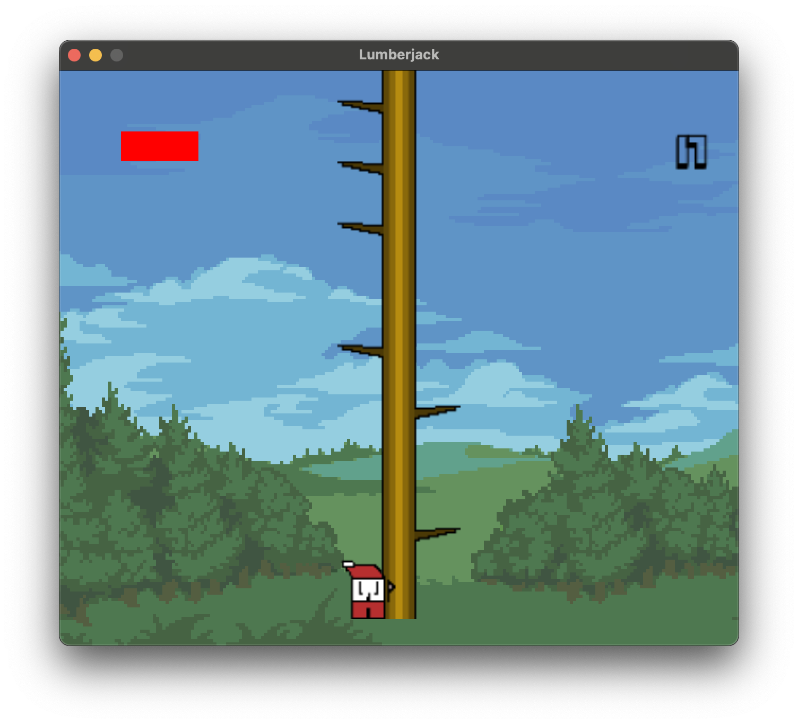
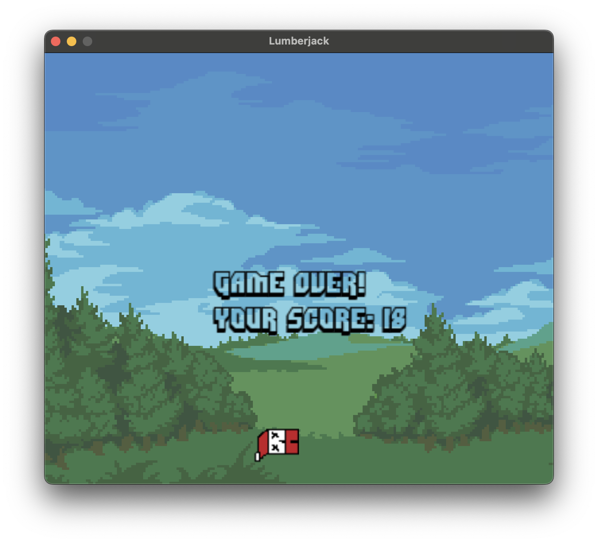

# love-game-lumberjack

## About

Some test game with using love2D framework




## How to install
- Install [love2D](https://love2d.org)
- Download repo and open in application:
```bash
git clone https://github.com/meshchaninov/love-game-lumberjack
love love-game-lumberjack
```

## How to play
Use arrows to chop down a tree
Use Space to reset the game

